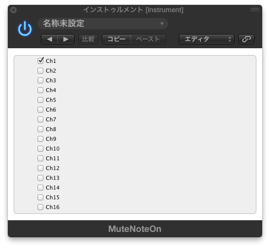

AUMuteNoteOn
============

Mute NoteOn MIDI Signal

This MIDI FX Plugin stop only NoteOn events in checked channels.

## Installation

Generally, Audio Units Plugins are only for Mac OSX.

1. Click "Download ZIP" and extract AUMuteNoteOn.component.
2. Move AUMuteNoteOn.component to /Library/Audio/Plug-Ins/Components

## Available DAW

* Logic Pro X
* Mainstage 3

## License

AUMuteNoteOn has an MIT Licence http://en.wikipedia.org/wiki/MIT_License
